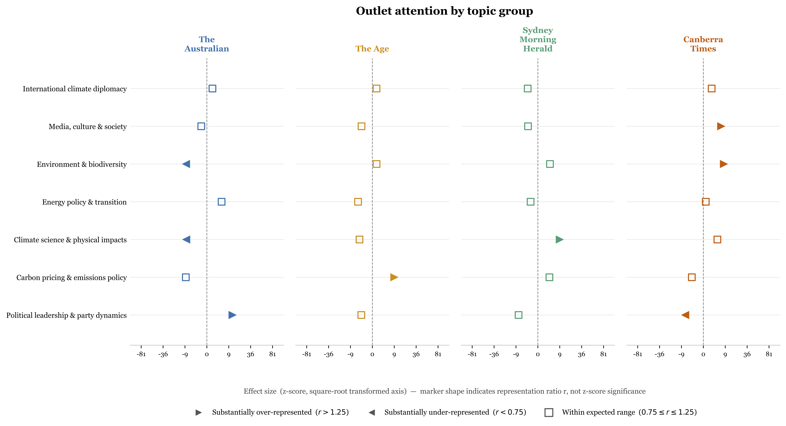

# Climate Change Discourse Across Australian News Media, 1987–2026

**Bhavna J. Antony, Cameron Foale, Savin Chand**

*Institute of Innovation, Science and Sustainability, Federation University Australia*

### Abstract

Despite an extensive literature on climate change news coverage, the long-form opinion and editorial journalism through which public arguments about climate policy are actively constructed has received comparatively little computational attention, particularly in the Australian context. This paper presents a longitudinal analysis of climate opinion discourse across five major English-language publications, comprising 28,801 articles from *The Guardian* (Australian edition), *The Age*, the *Sydney Morning Herald*, *The Canberra Times*, and *The Australian* spanning the period 1987 to 2026. Thematic structure was identified using BERTopic, a neural topic modelling framework combining contextual sentence embeddings and density-based clustering. The pipeline recovered 75 coherent topics grouped into 11 thematic categories. Differential topic attention was assessed using binomial representation ratios and z-scores. Letters to the editor (*n* = 1,238) were projected into the fitted topic space and treated as a sixth analytical unit alongside the five editorial corpora. The results revealed structural patterns. *The Guardian* is substantially over-represented in globally oriented groups including Energy Transition & Technology, Climate Science, and International Negotiations & Geopolitics, while the four Australian mastheads concentrate their coverage in Australian Politics & Policy. Overall, the climate change discourse predominantly occurs in conjunction with politics, while the science, impacts and technological innovations that could alleviate the effects of climate change do not get much attention. These findings provide the first computational characterisation of Australian climate opinion journalism at scale and document systematic outlet-level differences in thematic emphasis not reducible to differences in corpus size.

---

### Key Results



*Binomial effect sizes (z-score, square-root transformed axis) for each outlet–topic-group combination. Filled triangles indicate significant over- (▶, z > 2) or under-representation (◀, z < −2) relative to the outlet's corpus share; open squares indicate no significant deviation (|z| ≤ 2). Rows sorted by Guardian z-score, descending.*

The outlet–topic structure reveals a near-perfect institutional partition. The four Australian mastheads concentrate their commentary heavily in Australian Politics & Policy (*The Australian*: r = 3.74; *The Age*: r = 3.40; *SMH*: r = 3.41; *Canberra Times*: r = 2.47), while *The Guardian* is equivalently under-represented in that group (r = 0.18). The direction reverses for almost every globally oriented theme: *The Guardian* is significantly over-represented in Energy Transition & Technology, Climate Science, Nature, Ecosystems & Food Systems, Fossil Fuels, Divestment & Carbon Markets, and International Negotiations — not merely because it dominates the corpus (73.2% share), but after standardising for that share via binomial representation ratios.

Letters to the editor constitute a distinct discursive voice. They are strongly over-represented in Australian Energy, Water & Resources (r = 4.99) and Australian Politics & Policy (r = 2.24), and systematically absent from globally oriented groups — suggesting that citizen engagement in this corpus is oriented toward immediate domestic energy and governance questions rather than international climate diplomacy or science.

Overall, Australian climate opinion journalism is predominantly mediated through a political lens. The science, physical impacts, and technological dimensions of climate change receive comparatively little sustained attention outside *The Guardian*, a pattern that persists across nearly four decades and is not reducible to differences in outlet size.

---

Reproducible code for the corpus construction and topic modelling pipeline used in:

> Antony, B. (in prep). *A Climate of Opinion: Climate Change Discourse Across Australian News Media, 1987–2026.*

---

## Overview

This pipeline collects, parses, scores, and topic-models climate-related editorial and opinion articles from five English-language publications spanning 1987–2026:

| Publication | Access method |
|---|---|
| The Guardian (Australian edition) | Guardian Open Platform API |
| Sydney Morning Herald | NewsBank Australia (PDF export) |
| The Age | NewsBank Australia (PDF export) |
| The Canberra Times | NewsBank Australia (PDF export) |
| The Australian | NewsBank Australia (PDF export) |

The final corpus contains **27,563** editorial and opinion articles and **1,238** letters to the editor after relevance screening.

> **Note:** Article body text is not included in this repository due to NewsBank and Guardian licensing restrictions. The pipeline scripts are provided for transparency and reproducibility; to run them you will need your own NewsBank access and a Guardian API key.

---

## Pipeline

The pipeline runs in five steps:

```
1. fetch_guardian.py          →  guardian_articles.csv
2. [manual] download NewsBank PDFs
3. cache_bodies.py            →  newsbank_bodies.parquet
4. build_articles_scored.py   →  data/articles_scored.csv
5. run_bertopic.py            →  data/combined-no-letters/topic_assignments.csv
                                  data/letters/topic_assignments.csv
```

---

## Setup

### 1. Install system dependency

`parse_newsbank.py` calls `pdftotext` (part of `poppler-utils`) to extract text from NewsBank PDF exports. Install it before running the pipeline:

```bash
# Ubuntu/Debian
sudo apt install poppler-utils

# macOS
brew install poppler
```

### 2. Install Python packages

```bash
pip install -r requirements.txt
```

### 3. Configure paths and API key

Edit `config.py`:

- Set `NEWSBANK_ROOT` to the directory containing your downloaded NewsBank PDF folders.
- Set `GUARDIAN_API_KEY` to your Guardian Open Platform API key (see below).

#### Obtaining a Guardian API key

The Guardian Open Platform provides free API access for non-commercial and research use.

1. Register at https://open-platform.theguardian.com/access/
2. Select the **Developer** tier (free; up to 500 calls/day, sufficient for this pipeline).
3. You will receive a key by email within a few minutes.
4. Paste the key into `config.py`:

```python
GUARDIAN_API_KEY = "your-key-here"
```

> **Important:** never commit your API key to version control. If you fork this repository, store the key in an environment variable and read it with `os.environ.get("GUARDIAN_API_KEY")`.

---

## Running the pipeline

### Step 1 — Fetch Guardian articles

```bash
python fetch_guardian.py
```

Queries the Guardian Open Platform API and writes `guardian_articles.csv`. Run once; re-run to update to the current date.

### Step 2 — Download NewsBank PDFs (manual)

Log in to [NewsBank Australia](https://infoweb.newsbank.com) and export PDF bundles for each publication and content category as configured in `NEWSBANK_FOLDERS` in `config.py`. Place the folders under `NEWSBANK_ROOT`.

### Step 3 — Cache NewsBank body text

```bash
python cache_bodies.py
```

Parses all NewsBank PDFs using `pdftotext` and writes body text to `data/newsbank_bodies.parquet` (or `.pkl.gz` if pyarrow is unavailable). Run with `--force` to rebuild from scratch.

### Step 4 — Build scored article catalogue

```bash
python build_articles_scored.py
```

Merges Guardian and NewsBank sources, applies the relevance criterion, assigns content-type classifications, and writes `data/articles_scored.csv`.

### Step 5 — Run BERTopic topic modelling

```bash
# Fit model on editorial corpus (excluding letters)
python run_bertopic.py --corpus combined --exclude-letters

# Project letters into the fitted topic space
python run_bertopic.py --corpus combined --exclude-letters --transform-only
```

Outputs `data/combined-no-letters/topic_assignments.csv` and `data/letters/topic_assignments.csv`.

Key options:

| Flag | Default | Description |
|---|---|---|
| `--embedding-model` | `nomic-ai/nomic-embed-text-v1` | Sentence embedding model |
| `--min-topic-size` | `50` | Minimum cluster size |
| `--outlier-strategy` | `embeddings` | Outlier reassignment method |
| `--outlier-threshold` | `0.5` | Cosine similarity threshold for reassignment |
| `--device` | `auto` | `cpu` or `cuda` |

---

## Relevance criterion

An article is **included** if **any** of the following hold:

| Condition | Rule |
|---|---|
| (a) High direct frequency | `cc_count + gw_count ≥ 3` |
| (b) Title hit | Title contains "climate change" or "global warming" |
| (c) Broad climate vocabulary | `cc_count + gw_count ≥ 1` AND `climate_mentions ≥ 4` |

`climate_mentions` counts occurrences of any term in the 47-term `CLIMATE_TERMS` vocabulary defined in `config.py`.

---

## Repository structure

```
repo/
├── config.py                  # Paths, API keys, thresholds, folder definitions
├── fetch_guardian.py          # Step 1: Guardian API fetcher
├── parse_newsbank.py          # NewsBank PDF parser (called by cache_bodies)
├── cache_bodies.py            # Step 3: NewsBank body text cache builder
├── score_and_classify.py      # Relevance scoring logic (called by build_articles_scored)
├── build_articles_scored.py   # Step 4: scored article catalogue builder
├── run_bertopic.py            # Step 5: BERTopic topic modelling pipeline
├── analyse_clusters.py        # Deep-dive visualisations per topic group
├── outlet_topic_attention.py  # Binomial representation analysis across outlets
├── make_figures.py            # Corpus overview figures
├── make_prisma.py             # PRISMA flow diagram
├── requirements.txt
└── README.md
```

---

## Citation

If you use this pipeline, please cite the paper above and link to this repository.

---

## Licence

Code: MIT
Article content: not included (subject to NewsBank and Guardian licensing terms)
